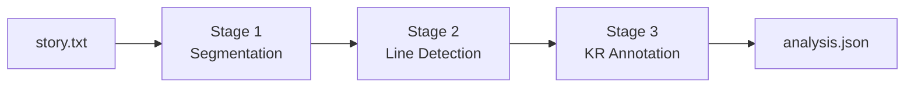

# GTVH Analyzer: A Tool for Analyzing Short Stories Using the General Theory of Verbal Humor

An LLM pipeline that annotates humorous short stories using the
**General Theory of Verbal Humor** by Attardo & Raskin. It works by locating each
humorous instance in a text and identifying the Knowledge Resources
(Script Opposition, Situation, Target, Narrative Strategy, Language)
that make it funny.

No model training. No symbolic parsing. Just carefully staged LLM
calls with a Pydantic schema as the contract between stages, built to
be legible and editable rather than clever.


## Why this exists

Raskin's Semantic Script Theory of Humor (1985) and Attardo's General Theory of Verbal Humor (1994) give necessary-and-sufficient conditions for why a text is funny, an actual "falsifiable", linguistic theory of humor competence with a defined annotation scheme. Attardo (2001) extends it from single jokes to full-length narrative texts. This project applies that extended scheme to short stories at scale, using LLMs to do the line-by-line annotation work that a human analyst would otherwise do by hand.

See [`THEORY.md`](./THEORY.md) for the full account of which parts of the theory are implemented and which are deliberately deferred.

## How it works

Three LLM stages, each a separate prompt file you can edit without
touching code:



1. **Segmentation** (`prompts/segment.md`) partitions the story into
   narrative segments using metatextual markers, setting changes, and
   character entries/exits. One call per story. This matters because
   a *punch* line is defined by ending a narrative unit, and a *jab*
   line by not, so the pipeline needs to know where units begin and
   end before it can classify anything.

2. **Line detection** (`prompts/detect_lines.md`) for each segment, it
   locates humorous spans and classifies them as `discrete`
   (single-trigger), `register_clash` (diffuse register humor), or
   `irony`. One call per segment, run concurrently.

3. **KR annotation** (`prompts/annotate_krs.md`) for each detected
   line, fills in the full Knowledge Resource bundle with local
   context: Script Opposition, Situation, Target, 
   Narrative Strategy, and Language. One call per line, heavily parallelized.

Everything downstream of a stage only sees the Pydantic object that
stage returns. Prompts are free to change wording as long as the
schema in `schemas.py` matches.

## Quick start

```bash
git clone <this-repo>
cd gtvh-analyzer

python -m venv .venv
.venv\Scripts\activate
pip install -r requirements.txt

cp .env.example .env
# edit .env and paste your OpenAI API key

# drop one or more .txt story files into input/
python cli.py
# analysis JSON lands in output/
```

Single-file mode:

```bash
python cli.py --file path/to/story.txt --out path/to/analysis.json
```

Options:

```bash
python cli.py --model gpt-4.1 --detect-concurrency 5 --annotate-concurrency 10
```

## Project layout

```
gtvh-analyzer/
├── input/                    # drop .txt story files here
├── output/                   # analysis JSON lands here
├── prompts/
│   ├── segment.md            # Stage 1
│   ├── detect_lines.md       # Stage 2
│   └── annotate_krs.md       # Stage 3
├── stages/
│   ├── segment.py
│   ├── detect.py
│   └── annotate.py
├── schemas.py                # Pydantic schemas
├── llm.py                    # OpenAI structured-output wrapper
├── pipeline.py               # end-to-end orchestration
├── cli.py                    # entry point
├── THEORY.md                 # theoretical grounding & design decisions
├── requirements.txt
└── .env.example
```

## Editing prompts

Prompts are plain `.md` files read from disk on every run. You can edit and
re-run, no restart needed. If an edit changes what fields a stage
*returns* (not just how it reasons), update the matching Pydantic
model in `schemas.py` to match; nothing else in the codebase needs to
change, since `stages/`, `pipeline.py`, and `cli.py` only ever handle
these as opaque validated objects.

## Status & limitations

- **Logical Mechanism (LM)** is intentionally not implemented. See
  `THEORY.md` for why.
- No held-out gold-annotated corpus yet; prompt quality is being
  evaluated by hand against a small number of stories.
- Single LLM provider (OpenAI) at the moment; `llm.py` is the only file
  that would need to change to support another.
- Stylistic-insights (Stage 4: strands, stacks, bridges/combs,
  line-position typology) is not yet built. This pipeline currently
  covers only per-line KR annotation.

## References

- Raskin, V. (1985). *Semantic mechanisms of humor.* D. Reidel.
- Attardo, S. (1994). *Linguistic theories of humor.* Mouton de Gruyter.
- Attardo, S. (2001). *Humorous Texts: A Semantic and Pragmatic Analysis.* Mouton de Gruyter.
- Attardo, S. (2020). *The Linguistics of Humor: An Introduction.* Oxford University Press.

## Credits and Acknowledgments
- **Ahmad Yasin** - Lead Developer / Lead Prompt Engineer
- **Kahf-ul-Wara** - Thank you for your help with prompt engineering, prompt testing and evaluation.
- **Hureeza Abid** - Thank you for your help with initial operationalization and development of prompts.


## Associated Research & Citation

This software was developed as the practical implementation of our academic research. The foundation of this project is based on three separate but interconnected theses. If you use this software in an academic, official, or commercial capacity, we encourage you to cite the software.

### Theses References
---
> Yasin, A. (2025). *Augmenting LLMs with General Theory of Verbal Humor for multimodal humor analysis* [Unpublished MPhil thesis]. Government College University Faisalabad.

> Wara, K. (2026). *Computational Analysis of Humorous Narratives using the General Theory of Verbal Humor* [Unpublished MPhil thesis]. Government College University Faisalabad.

> Abid, H. (2025). *AUTOMATING HUMOR ANALYSIS USING LLMS: AN APPLICATION OF THE GENERAL THEORY OF VERBAL HUMOR* [Unpublished MPhil thesis]. Government College University Faisalabad.

---

### Software Citation
To cite the software repository itself you can use the [`CITATION.cff`](./CITATION.cff) file included in this repository, or use the following reference:

> Yasin, Ahmad., Wara, Kahf-ul., & Abid, Hureeza. (2024). *GTVH Analyzer: A Tool for Analyzing Short Stories Using the General Theory of Verbal Humor* [Computer software]. GitHub. https://github.com/iamahmadyasin/gtvh-analyzer

## License

MIT — see [`LICENSE`](./LICENSE).