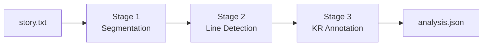

# GTVH Analyzer: A Tool for Analyzing Short Stories Using the General Theory of Verbal Humor

An LLM pipeline that annotates humorous short stories using the
**General Theory of Verbal Humor** by Attardo & Raskin. It works by locating each
humorous instance in a text and identifying the Knowledge Resources
(Script Opposition, Situation, Target, Narrative Strategy, Language)
that make it funny.

No model training. No symbolic parsing. Just carefully staged LLM
calls with a Pydantic schema as the contract between stages, built to
be legible and editable rather than clever.


## Why this exists

Raskin's Semantic Script Theory of Humor (1985) and Attardo's General Theory of Verbal Humor (1994) give necessary-and-sufficient conditions for why a text is funny, an actual "falsifiable", linguistic theory of humor competence with a defined annotation scheme. Attardo (2001) extends it from single jokes to full-length narrative texts. This project applies that extended scheme to short stories at scale, using LLMs to do the line-by-line annotation work that a human analyst would otherwise do by hand.

See [`THEORY.md`](./THEORY.md) for the full account of which parts of the theory are implemented and which are deliberately deferred.

## How it works

Three LLM stages, each a separate prompt file you can edit without
touching code:



1. **Segmentation** (`prompts/segment.yaml`) partitions the story into
   narrative segments using metatextual markers, setting changes, and
   character entries/exits. One call per story. This matters because
   a *punch* line is defined by ending a narrative unit, and a *jab*
   line by not, so the pipeline needs to know where units begin and
   end before it can classify anything.

2. **Line detection** (`prompts/detect_lines.yaml`) for each segment, it
   locates humorous spans and classifies them as `discrete`
   (single-trigger), `register_clash` (diffuse register humor), or
   `irony`. One call per segment, run concurrently.

3. **KR annotation** (`prompts/annotate_krs.yaml`) for each detected
   line, fills in the full Knowledge Resource bundle with local
   context: Script Opposition, Situation, Target, 
   Narrative Strategy, and Language. One call per line, heavily parallelized.

Everything downstream of a stage only sees the Pydantic object that
stage returns. Prompts are free to change wording as long as the
schema in `schemas.py` matches.

## Quick start

```bash
git clone <this-repo>
cd gtvh-analyzer

python -m venv .venv
venv\Scripts\activate
pip install -r requirements.txt

cp .env.example .env
# edit .env and paste your OpenAI API key

# drop one or more .txt story files into input/
python cli.py --model gpt-5.6-luna --no-temperature

python make_report.py
```
`--model` is required. The `--no-temperature` flag is needed for the
GPT-5.6 family and other models that only accept their default
temperature; drop it if your model accepts `temperature=0`.

Single-file mode:

```bash
python cli.py --model gpt-5.6-luna --no-temperature --file path/to/story.txt --out path/to/analysis.json

python make_report.py --json output/x.json
```

Options:

```bash
python cli.py --model gpt-5.6-luna --no-temperature \
    --detect-concurrency 1 --annotate-concurrency 1 \
    --context story      # or: local
    --fresh            # ignore saved checkpoints
    --batch            # Batch API: discounted, results within 24h
```
Concurrency defaults are low (to respect token-per-minute rate limits);
raise them if your rate tier allows. The client retries automatically
on rate-limit errors with exponential backoff.

## Cost controls: prompt caching and checkpoints

**Prompt caching.** OpenAI bills a repeated prompt prefix of 1,024+
tokens at its cached-input rate. Detection and annotation calls are
ordered so everything shared comes first (the stage's system prompt,
then the full numbered story) and only the segment- or line-specific
part comes last. Each call carries a `prompt_cache_key` so calls that
share a prefix hit the same cache, and the first call of each stage
runs alone so the cache is warm before the rest start.

`--context` chooses what those calls see:

- `story` (default): the full story. Most accurate: callbacks and
  running gags set up in other segments are visible. After the first
  call of a stage, the story is billed at the cached rate.
- `local`: only the segment's own lines (detection) or 5 lines around
  the humorous line (annotation). Fewest tokens, least context.

**Checkpoints.** Every successful model response is saved under
`output/.checkpoints/`, keyed by a hash of the model, temperature,
messages and response schema. If a run fails partway, re-running the
same command repeats only the failed calls. Editing a prompt re-runs
only the calls that prompt affects (and anything downstream whose input
changed). Use `--fresh` to ignore saved checkpoints and sample again;
delete the folder to reclaim space.

**Batch API.** `--batch` sends requests through OpenAI's Batch API,
which is billed at a discount (50% at the time of writing) in exchange
for results within 24 hours rather than immediately. Research runs
rarely need answers in seconds, so this is the largest saving that
doesn't change what the model sees. Check that your model is offered
on the Batch API before relying on it.

```bash
python cli.py --model gpt-5.6-luna --no-temperature --batch
```

In batch mode every story in `input/` is analyzed together, so a run is
three batches: all segmentation calls, then all detection calls, then
all annotation calls (each stage needs the previous one's results).
Progress is printed at each poll. If you stop the process while it
waits, the batch keeps running on OpenAI's side; re-run the same
command and it resumes that batch rather than submitting (and paying
for) it again. Results land in the same checkpoints as online runs, so
you can mix the two: for example, batch the whole corpus, then re-run
one story online after editing a prompt.

Each story's run (or, with `--batch`, the whole run) ends with a usage
line (API calls, checkpoint hits, input tokens with the cached share,
output tokens), so you can see what caching is saving.

## Project layout

```
gtvh-analyzer/
├── input/                    # drop .txt story files here
├── output/                   # analysis JSON lands here
│   └── .checkpoints/         # saved model responses (safe to delete)
├── prompts/
│   ├── segment.yaml          # Stage 1
│   ├── detect_lines.yaml     # Stage 2
│   └── annotate_krs.yaml     # Stage 3
├── stages/
│   ├── segment.py
│   ├── detect.py
│   └── annotate.py
├── schemas.py                # Pydantic schemas
├── textutils.py              # shared text helpers (no LLM dependency)
├── llm.py                    # OpenAI structured-output wrapper, caching, checkpoints
├── batch.py                  # Batch API client (--batch)
├── promptlib.py              # loads and checks prompts/*.yaml
├── pipeline.py               # end-to-end orchestration
├── cli.py                    # entry point
├── make_report.py            # builds a reviewable .xlsx from an analysis JSON
├── THEORY.md                 # theoretical grounding & design decisions
├── requirements.txt
└── .env.example
```

## Editing prompts

Each stage's prompt is a YAML file in `prompts/`, read from disk on
every run, so you can edit and re-run with no restart. A file has
three parts:

- `system`: the instructions sent as the system message. The text
  inside is ordinary markdown in a `|` block; keep it indented.
- `templates`: the user message(s) the stage fills in, using Python
  `str.format` fields such as `{segment_id}`. Write a literal brace as
  `{{` or `}}`. Shared parts (the full story) come first so they can be
  served from the prompt cache.
- `enums`: schema enums whose every value must appear in `system` in
  backticks (for example `` `obscene_nonobscene` ``). The file refuses
  to load if the prompt and `schemas.py` disagree, so a renamed or
  added category can't silently go undocumented.

If an edit changes what fields a stage *returns* (not just how it
reasons), update the matching Pydantic model in `schemas.py` to match;
nothing else in the codebase needs to change, since `stages/`,
`pipeline.py`, and `cli.py` only ever handle these as opaque validated
objects.

## Reviewing annotations

`make_report.py` turns an analysis JSON into an Excel workbook built
for manual review, not just a data dump.

- **Story** sheet: the full text, one row per line, rows with
  detected humor highlighted.
- **Annotations** sheet: one row per humorous line, every KR field as
  a column, filterable and sortable.
- **Segments** sheet: narrative structure for context.

Each annotation row links to its position in the Story sheet and back,
so you can jump between "what's the surrounding context" and "what did
the model say about this line" in one click. Two blank columns,
*Reviewer Verdict* and *Reviewer Notes*, are there for you to fill in
while reviewing.

## Status & limitations

- **Logical Mechanism (LM)** is intentionally not implemented. See
  `THEORY.md` for why.
- No held-out gold-annotated corpus yet. `make_report.py` produces a
  reviewable workbook (with Reviewer Verdict / Notes columns) for manual QA.
- Single LLM provider (OpenAI) at the moment; `llm.py` is the only file
  that would need to change to support another.
- Stylistic-insights (Stage 4: strands, stacks, bridges/combs,
  line-position typology) is not yet built. This pipeline currently
  covers only per-line KR annotation.

## References

- Raskin, V. (1985). *Semantic mechanisms of humor.* D. Reidel.
- Attardo, S. (1994). *Linguistic theories of humor.* Mouton de Gruyter.
- Attardo, S. (2001). *Humorous Texts: A Semantic and Pragmatic Analysis.* Mouton de Gruyter.
- Attardo, S. (2020). *The Linguistics of Humor: An Introduction.* Oxford University Press.

## Credits and Acknowledgments
- **Ahmad Yasin** - Lead Developer & Lead Prompt Engineer
- **Kahf-ul-Wara** - Testing & Evaluation
- **Hureeza Abid** - Initial Operationalization, Annotation & Prompt Development


## Associated Research & Citation

This software was developed as the practical implementation of our academic research. The foundation of this project is based on three separate but interconnected theses. If you use this software in an academic, official, or commercial capacity, we encourage you to cite the software.

### Theses References
---
> Yasin, A. (2025). *Augmenting LLMs with General Theory of Verbal Humor for multimodal humor analysis* [Unpublished MPhil thesis]. Government College University Faisalabad.

> Wara, K. (2026). *Computational Analysis of Humorous Narratives using the General Theory of Verbal Humor* [Unpublished MPhil thesis]. Government College University Faisalabad.

> Abid, H. (2025). *AUTOMATING HUMOR ANALYSIS USING LLMS: AN APPLICATION OF THE GENERAL THEORY OF VERBAL HUMOR* [Unpublished MPhil thesis]. Government College University Faisalabad.

---

### Software Citation
To cite the software repository itself you can use the [`CITATION.cff`](./CITATION.cff) file included in this repository, or use the following reference:

> Yasin, Ahmad., Wara, Kahf-ul., & Abid, Hureeza. (2024). *GTVH Analyzer: A Tool for Analyzing Short Stories Using the General Theory of Verbal Humor* [Computer software]. GitHub. https://github.com/iamahmadyasin/gtvh-analyzer

## License

MIT — see [`LICENSE`](./LICENSE).
