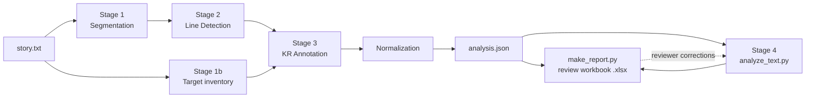

# GTVH Analyzer: A Tool for Analyzing Short Stories Using the General Theory of Verbal Humor

An LLM pipeline that annotates humorous short stories using the
**General Theory of Verbal Humor** by Attardo & Raskin. It works by locating each
humorous instance in a text and identifying the Knowledge Resources
(Script Opposition, Situation, Target, Narrative Strategy, Language)
that make it funny.

No model training. No symbolic parsing. Just carefully staged LLM
calls with a Pydantic schema as the contract between stages, built to
be legible and editable rather than clever.


## Why this exists

Raskin's Semantic Script Theory of Humor (1985) and Attardo's General Theory of Verbal Humor (1994) give necessary-and-sufficient conditions for why a text is funny, an actual "falsifiable", linguistic theory of humor competence with a defined annotation scheme. Attardo (2001) extends it from single jokes to full-length narrative texts. This project applies that extended scheme to short stories at scale, using LLMs to do the line-by-line annotation work that a human analyst would otherwise do by hand.

See [`THEORY.md`](./THEORY.md) for the full account of which parts of the theory are implemented and which are deliberately deferred.

## How it works

Per-line LLM stages, each a separate prompt file you can edit without
touching code, then a text-level stage that runs on the saved results:


```mermaid
flowchart LR
    A[story.txt] --> B[Stage 1\nSegmentation]
    A --> B2[Stage 1b\nTarget inventory]
    B --> C[Stage 2\nLine Detection]
    C --> D[Stage 3\nKR Annotation]
    B2 --> D
    D --> N[Normalization]
    N --> E[analysis.json]
    E --> F[make_report.py\nreview workbook .xlsx]
    E --> T[Stage 4\nanalyze_text.py]
    F -. reviewer corrections .-> T
    T --> F
```

1. **Segmentation** (`prompts/segment.yaml`) partitions the story into
   narrative segments using metatextual markers, setting changes, and
   character entries/exits. One call per story. This matters because
   a *punch* line is defined by ending a narrative unit, and a *jab*
   line by not, so the pipeline needs to know where units begin and
   end before it can classify anything.

   **Target inventory** (`prompts/target_inventory.yaml`) runs alongside
   it: one call per story listing the characters, groups, institutions
   and ideas the story is likely to target, each tagged with its kind
   (person, group, institution, idea), social class, and social sphere.

2. **Line detection** (`prompts/detect_lines.yaml`) for each segment, it
   locates humorous spans and classifies them as `discrete`
   (single-trigger), `register_clash` (diffuse register humor), or
   `irony`. One call per segment. Lines inside an embedded segment (a
   letter, a speech) are checked only with that segment, so no joke is
   found twice. Line IDs (`HL-001`, ...) follow story order.

3. **KR annotation** (`prompts/annotate_krs.yaml`) for each detected
   line, writes a short `reasoning` first and then fills in the
   Knowledge Resource bundle: Script Opposition, Situation, Target,
   Narrative Strategy (from a fixed list), and Language. One call per
   line. The model is given the target inventory and reuses an entry
   (`target_id`) whenever one fits, adding a new target only when none
   does.

   **Normalization** then gives every line a *canonical target* (the
   inventory label, or a grouped label for new targets) and a
   *canonical situation* (paraphrases of one frame grouped under its
   most frequent wording; `cotext` and `irr` are never merged). Grouping
   uses OpenAI embeddings, or string similarity with `--normalize string`
   (no API call). Strands depend on these values being consistent.

4. **Text-level analysis** (`analyze_text.py`, Stage 4) runs separately on
   saved analyses: distribution, strands, combs and bridges, and jab/punch
   counts are computed without any API call, then one interpretive call
   (`prompts/interpret_plot.yaml`) assigns the story one of Attardo's four
   humorous plot types. See [Text-level analysis](#text-level-analysis-stage-4).

By default, detection and annotation calls see the full story as
context (see `--context` below).

Everything downstream of a stage only sees the Pydantic object that
stage returns. Prompts are free to change wording as long as the
schema in `schemas.py` matches.

## Quick start

```bash
git clone <this-repo>
cd gtvh-analyzer

python -m venv .venv
source .venv/bin/activate        # Windows: .venv\Scripts\activate
pip install -r requirements.txt

cp .env.example .env             # Windows: copy .env.example .env
# edit .env and paste your OpenAI API key

# drop one or more .txt story files into input/
python cli.py --model gpt-5.6-luna --no-temperature   # writes output/<story>.json
python make_report.py                                 # writes output/<story>.xlsx

# optional: correct Canonical Target / Canonical Situation in the workbook, save, then
python analyze_text.py --model gpt-5.6-luna           # writes output/text_level/<story>.json
python make_report.py                                 # adds Strands, Distribution, Plot sheets
python make_reader.py                                 # writes output/<story>.html, a readable view
```
`--model` is required. The `--no-temperature` flag is needed for the
GPT-5.6 family and other models that only accept their default
temperature; drop it if your model accepts `temperature=0`.

Single-file mode:

```bash
python cli.py --model gpt-5.6-luna --no-temperature --file path/to/story.txt --out path/to/analysis.json

python make_report.py --json path/to/analysis.json --story path/to/story.txt
```

`make_report.py` finds the story text in `input/` by its file name, so
`--story` is only needed when the story lives somewhere else. With no
arguments it builds a report for every JSON in `output/`.

Options:

| Flag | Default | What it does |
|---|---|---|
| `--model` | required | OpenAI model id |
| `--no-temperature` | off | omit `temperature` (needed for models that reject it) |
| `--file`, `--out` | all of `input/` | analyze one story, write its JSON to `--out` |
| `--detect-concurrency` | 1 | parallel detection calls |
| `--annotate-concurrency` | 1 | parallel annotation calls |
| `--context` | `story` | `story` (full story as context) or `local` (segment text; for annotation, 5 lines plus a "story so far" from the segment descriptions) |
| `--fresh` | off | ignore saved checkpoints and call the model again |
| `--batch` | off | use the Batch API: discounted, results within 24 hours |
| `--normalize` | `embeddings` | group situations and new targets with OpenAI embeddings, or `string` similarity (no API call) |
| `--embedding-model` | `text-embedding-3-small` | embedding model for `--normalize embeddings` |
| `--situation-threshold` | 0.80 | minimum similarity for two situation phrases to share a canonical label |
| `--target-threshold` | 0.80 | minimum similarity for a new target to join an inventory entry or another new target |

For example:

```bash
python cli.py --model gpt-5.6-luna --no-temperature --annotate-concurrency 4 --context local
```

Concurrency defaults are low (to respect token-per-minute rate limits);
raise them if your rate tier allows. The client retries automatically
on rate-limit errors with exponential backoff.

## Text-level analysis (Stage 4)

Following Attardo's expanded GTVH for longer texts (*Humorous Texts*,
2001; "Cognitive stylistics of humorous texts"), the per-line
annotations of a story are turned into text-level findings: how the
humor is distributed, which strands connect the lines, how the strands
are laid out, and what kind of humorous plot the story has. It runs on
saved analyses, so the per-line pipeline doesn't have to be re-run:

```bash
python analyze_text.py --model gpt-5.6-luna                       # every output/*.json
python analyze_text.py --json output/story.json --no-interpret    # metrics only, no API call
python analyze_text.py --model gpt-5.6-luna --n-sections 30 --min-strand-lines 4
```

**Deterministic part** (`textlevel.py`, no API calls):

- **Distribution.** The text is cut into equal word-count sections; the
  humorous lines in each are counted and the words-per-line ratio is
  given for the whole text and each section. Two Monte Carlo tests
  compare the result with Attardo's two null hypotheses: *uniform*
  (every section has the same amount of humor; Pearson chi-square of
  the section counts) and *random* (lines placed independently at
  random; coefficient of variation of the gaps between lines, where
  higher means clustered and lower means more evenly spaced). Peaks
  ("waves") and serious-relief stretches (long runs with few or no
  lines) are identified.
- **Strands.** Sets of lines sharing a value on one KR feature, or a
  pair of features from different KRs (for example target plus
  opposition type). Features: canonical target, target kind, target
  social class, target sphere, orientation, canonical situation,
  essential binary category (the intermediate level of script
  opposition), opposition type, narrative strategy, wordplay level,
  register effect. Each strand is classified central, intermediate, or
  peripheral, with its share of all lines. Keys that select exactly the
  same lines are reported once, with the alternatives as equivalent
  keys.
- **Combs and bridges** within each strand, using distances measured as
  fractions of the text's length.
- **Jab/punch distribution** by segment and by narrative level, plus a
  few plot indicators (final punch lines, metanarrative lines, framing
  segments).

**Interpretive call** (`stages/interpret.py`, one call per story, no
temperature sent). It sees the computed aggregates and the segment
descriptions, never the per-line annotations, and returns:
- one of Attardo's four humorous plot types (serious plot with jab
  lines; humorous plot with punch line; with metanarrative disruption;
  with a humorous central complication);
- the central complication;
- pattern findings, each citing the strands or counts behind it;
- hedged readings built on those findings.

Cited ids are checked against the aggregates, and any the model
invented are reported as citation warnings.

**Reviewer corrections.** If the story's workbook (`output/<story>.xlsx`)
exists, values you corrected in its Canonical Target and Canonical
Situation columns are used instead of the pipeline's. A target you
type that matches an inventory entry's label or alias takes that
entry's attributes. Clearing a cell means "no value". Use
`--no-review` to ignore the workbook.

**Output.** `output/text_level/<story>.json` holds the metrics, every
parameter value used, hashes of the analysis and story text, per-line
feature values, and the interpretation. Strand keys are stable
`feature=value` strings, so a later corpus stage (stacks, baselines)
can combine these files across stories without re-running anything.
`make_report.py` adds them to the workbook as **Strands**,
**Distribution** (with a native Excel bar chart of lines per section),
and **Plot** sheets.

**Parameters.** Attardo gives no numeric thresholds, so every threshold
is a named parameter with a documented default, and the values used are
recorded in each output file:

| Flag | Default | Meaning |
|---|---|---|
| `--n-sections` | 20 | Number of equal word-count sections the text is cut into. Attardo used 100-word sections for a ~12,800-word story; for short stories a fixed count keeps sections comparable across texts. |
| `--n-simulations` | 5000 | Monte Carlo draws used for the distribution tests' p-values. |
| `--seed` | 0 | Random seed for the Monte Carlo draws (results are reproducible). |
| `--alpha` | 0.05 | Significance level used to word the test conclusions. |
| `--wave-min-ratio` | 1.5 | A section belongs to a wave (peak) if it has at least this many times the mean lines per section. |
| `--wave-min-lines` | 3 | A wave must contain at least this many lines in total. |
| `--relief-max-ratio` | 0.25 | A section belongs to a serious-relief stretch if it has at most this many times the mean lines per section. |
| `--relief-min-fraction` | 0.1 | A serious-relief stretch must cover at least this fraction of the text (Attardo's example was ~1,000 of ~12,800 words). |
| `--min-strand-lines` | 3 | A strand needs at least this many lines. |
| `--strand-pairs` | cross_kr | Pairwise strands: 'none', 'cross_kr' (every pair of features from different KRs), or a comma list such as 'target+opposition_type,target_social_class+so_binary_category'. |
| `--central-min-span` | 0.6 | A strand is central if its first and last lines are at least this fraction of the text apart (it 'occurs through most of a text'). |
| `--peripheral-max-span` | 0.3 | A strand is peripheral if it is confined to at most this fraction of the text. Strands in between are reported as intermediate. |
| `--comb-min-lines` | 3 | A comb needs at least this many lines of one strand. |
| `--comb-max-gap` | 0.03 | Consecutive lines of a comb are at most this fraction of the text apart. |
| `--bridge-min-gap` | 0.25 | Two consecutive lines of a strand at least this fraction of the text apart form a bridge. |
| `--final-punch-window` | 0.05 | A punch line ending within this final fraction of the text counts as a final punch line (a hint of a 'humorous plot with punch line'). |

The text-level command also takes:
- `--json`, `--story`, `--review` and `--out` for single files;
- `--max-strands` (default 20): the largest strands shown to the interpretive call;
- `--fresh`: ignore the saved interpretation checkpoint.

## Cost controls: prompt caching and checkpoints

**Prompt caching.** OpenAI bills a repeated prompt prefix of 1,024+
tokens at its cached-input rate. Detection and annotation calls are
ordered so everything shared comes first (the stage's system prompt,
then the full numbered story) and only the segment- or line-specific
part comes last. Each call carries a `prompt_cache_key` so calls that
share a prefix hit the same cache, and the first call of each stage
runs alone so the cache is warm before the rest start.

`--context` chooses what those calls see:

- `story` (default): the full story. Most accurate: callbacks and
  running gags set up in other segments are visible. After the first
  call of a stage, the story is billed at the cached rate.
- `local`: only the segment's own lines (detection) or 5 lines around
  the humorous line (annotation). Fewest tokens, least context.

**Checkpoints.** Every successful model response is saved under
`output/.checkpoints/`, keyed by a hash of the model, temperature,
messages and response schema. If a run fails partway, re-running the
same command repeats only the failed calls. Editing a prompt re-runs
only the calls that prompt affects (and anything downstream whose input
changed). Use `--fresh` to ignore saved checkpoints and sample again;
delete the folder to reclaim space.

**Batch API.** `--batch` sends requests through OpenAI's Batch API,
which is billed at a discount (50% at the time of writing) in exchange
for results within 24 hours rather than immediately. Research runs
rarely need answers in seconds, so this is the largest saving that
doesn't change what the model sees. Check that your model is offered
on the Batch API before relying on it.

```bash
python cli.py --model gpt-5.6-luna --no-temperature --batch
```

In batch mode every story in `input/` is analyzed together, so a run is
three batches: all segmentation calls, then all detection calls, then
all annotation calls (each stage needs the previous one's results).
Progress is printed at each poll. If you stop the process while it
waits, the batch keeps running on OpenAI's side; re-run the same
command and it resumes that batch rather than submitting (and paying
for) it again. Results land in the same checkpoints as online runs, so
you can mix the two: for example, batch the whole corpus, then re-run
one story online after editing a prompt.

Each story's run (or, with `--batch`, the whole run) ends with a usage
line (API calls, checkpoint hits, input tokens with the cached share,
output tokens), so you can see what caching is saving.

## Project layout

```
gtvh-analyzer/
├── input/                    # drop .txt story files here
├── output/                   # analysis JSON and review workbooks land here
│   ├── text_level/           # Stage 4 results, one JSON per story
│   └── .checkpoints/         # saved model responses (safe to delete)
├── prompts/
│   ├── segment.yaml          # Stage 1
│   ├── target_inventory.yaml # Stage 1b
│   ├── detect_lines.yaml     # Stage 2
│   ├── annotate_krs.yaml     # Stage 3
│   └── interpret_plot.yaml   # Stage 4 interpretive call
├── stages/
│   ├── segment.py
│   ├── inventory.py
│   ├── detect.py
│   ├── annotate.py
│   └── interpret.py
├── tests/                    # python -m unittest discover tests
├── schemas.py                # Pydantic schemas
├── textutils.py              # shared text helpers (no LLM dependency)
├── llm.py                    # OpenAI structured-output wrapper, caching, checkpoints
├── batch.py                  # Batch API client (--batch)
├── promptlib.py              # loads and checks prompts/*.yaml
├── normalize.py              # canonical targets and situations
├── textlevel.py              # Stage 4 metrics (deterministic, no API)
├── analyze_text.py           # Stage 4 entry point
├── review_workbook.py        # reads reviewer edits back from a workbook
├── pipeline.py               # end-to-end orchestration
├── cli.py                    # entry point
├── make_report.py            # builds a reviewable .xlsx (no OpenAI dependency)
├── make_reader.py            # builds a readable HTML view of a story (no OpenAI dependency)
├── THEORY.md                 # theoretical grounding & design decisions
├── requirements.txt
└── .env.example
```

## Editing prompts

Each stage's prompt is a YAML file in `prompts/`, read from disk on
every run, so you can edit and re-run with no restart. A file has
three parts:

- `system`: the instructions sent as the system message. The text
  inside is ordinary markdown in a `|` block; keep it indented.
- `templates`: the user message(s) the stage fills in, using Python
  `str.format` fields such as `{segment_id}`. Write a literal brace as
  `{{` or `}}`. Shared parts (the full story) come first so they can be
  served from the prompt cache.
- `enums`: schema enums whose every value must appear in `system` in
  backticks (for example `` `obscene_nonobscene` ``). The file refuses
  to load if the prompt and `schemas.py` disagree, so a renamed or
  added category can't silently go undocumented.

If an edit changes what fields a stage *returns* (not just how it
reasons), update the matching Pydantic model in `schemas.py` to match;
nothing else in the codebase needs to change, since `stages/`,
`pipeline.py`, and `cli.py` only ever handle these as opaque validated
objects.

## Reviewing annotations

`make_report.py` turns an analysis JSON into an Excel workbook built
for manual review, not just a data dump.

- **Story** sheet: the full text, one row per line, with its segment
  (the innermost one, for embedded letters and speeches). Rows with
  detected humor are highlighted; unhighlighted rows are where to look
  for humor the model missed.
- **Annotations** sheet: one row per humorous line, every KR field as
  a column, filterable and sortable. It also shows the detection
  confidence and reason (filter out `low` to review the likeliest
  lines first) and the model's reasoning for its annotation. The
  orange-headed **Canonical Target** and **Canonical Situation** columns
  hold the normalized values strands are built from. Correct them in
  place, and `analyze_text.py` will use your values. **Target Attributes**
  shows the inventory entry's kind, class and sphere.
- **Segments** sheet: narrative structure for context.
- **Strands**, **Distribution** (with a bar chart of lines per section),
  and **Plot** sheets, once `analyze_text.py` has been run for the story.

Each annotation row links to its position in the Story sheet and back,
so you can jump between "what's the surrounding context" and "what did
the model say about this line" in one click. Two blank columns are
there for you to fill in while reviewing: *Reviewer Verdict* (a
dropdown: Agree, Disagree, Partial, Unsure) and *Reviewer Notes*.

Re-running `make_report.py` keeps what you typed in those columns and
your canonical corrections, matching rows by line ID and text. Cells
you didn't touch pick up new pipeline values. Close the workbook in
Excel before rebuilding it.

## Reading view for non-technical readers

`make_reader.py` writes one self-contained HTML file per story
(`output/<story>.html`). It opens offline in any browser, makes no API
calls, and has no OpenAI dependency.

```bash
python make_reader.py                                            # every output/*.json
python make_reader.py --json output/story.json --title "The Vicar's Bicycle"
```

- **Reading view.**
  - The story appears as continuous text. Jab lines are marked in yellow, punch lines in pink, and embedded letters or speeches are set apart.
  - Hover over a joke for a one-line summary; click it for a plain-English card: the two ideas that collide, who it is aimed at, how it works, and whether it depends on the exact words. The model's reasoning and the technical tags are folded away underneath.
  - The arrow keys step through the jokes in order.
- **Whole-story summary**, once `analyze_text.py` has been run:
  - the plot type in Attardo's terms, and the central complication;
  - the main patterns with their figures, and any readings, labeled as interpretation;
  - a density strip beside the text, where darker means more jokes and hatched means serious relief;
  - filters that light up one strand (one target, setting, or kind of clash) across the whole story.
- **Margin notes.** A short numbered note beside each joke, like an annotated edition. This is the view the browser prints, with the summary on its own first page.

Corrected Canonical Target and Canonical Situation values from the story's workbook are used here too.

## Status & limitations

- **Logical Mechanism (LM)** is intentionally not implemented. See
  `THEORY.md` for why.
- No held-out gold-annotated corpus yet. `make_report.py` produces a
  reviewable workbook (with Reviewer Verdict / Notes columns) for manual QA.
- Single LLM provider (OpenAI) at the moment; `llm.py` (and `batch.py`
  for `--batch`) are the only files that would need to change to
  support another.
- **Stacks** (strands of strands across stories) and **corpus baselines**
  are not built yet. The per-story text-level files are designed to feed
  them without changes.
- The text-level thresholds are documented defaults, not values from
  the theory. Calibrate them on stories you have reviewed.
- Tests for the deterministic code: `python -m unittest discover tests`.

## References

- Raskin, V. (1985). *Semantic mechanisms of humor.* D. Reidel.
- Attardo, S. (1994). *Linguistic theories of humor.* Mouton de Gruyter.
- Attardo, S. (2001). *Humorous Texts: A Semantic and Pragmatic Analysis.* Mouton de Gruyter.
- Attardo, S. (2020). *The Linguistics of Humor: An Introduction.* Oxford University Press.

## Credits and Acknowledgments
- **Ahmad Yasin** - Lead Developer & Lead Prompt Engineer
- **Kahf-ul-Wara** - Testing & Evaluation
- **Hureeza Abid** - Initial Operationalization, Annotation & Prompt Development


## Associated Research & Citation

This software was developed as the practical implementation of our academic research. The foundation of this project is based on three separate but interconnected theses. If you use this software in an academic, official, or commercial capacity, we encourage you to cite the software.

### Theses References
---
> Yasin, A. (2025). *Augmenting LLMs with General Theory of Verbal Humor for multimodal humor analysis* [Unpublished MPhil thesis]. Government College University Faisalabad.

> Wara, K. (2026). *Computational Analysis of Humorous Narratives using the General Theory of Verbal Humor* [Unpublished MPhil thesis]. Government College University Faisalabad.

> Abid, H. (2025). *AUTOMATING HUMOR ANALYSIS USING LLMS: AN APPLICATION OF THE GENERAL THEORY OF VERBAL HUMOR* [Unpublished MPhil thesis]. Government College University Faisalabad.

---

### Software Citation
To cite the software repository itself you can use the [`CITATION.cff`](./CITATION.cff) file included in this repository, or use the following reference:

> Yasin, Ahmad., Wara, Kahf-ul., & Abid, Hureeza. (2026). *GTVH Analyzer: A Tool for Analyzing Short Stories Using the General Theory of Verbal Humor* [Computer software]. GitHub. https://github.com/iamahmadyasin/gtvh-analyzer

## License

MIT — see [`LICENSE`](./LICENSE).
